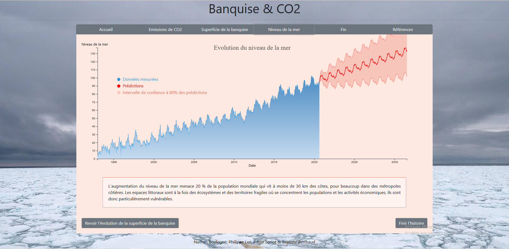

# Projet DataViz - Banquise & CO2

Ce projet de Dataviz a été réalisé dans le cadre du [Cours visualisation interactive de données](https://lyondataviz.github.io/teaching/lyon1-m2/2020/) du master [Data Science (Maths)](https://mastermas.univ-lyon1.fr/index.php/page1-2/) de l'[Université Claude-Bernard Lyon1](https://www.univ-lyon1.fr/).

## Membres
* [Philippe Lee](https://github.com/philippe-lee)
* [Nathan Boulogne](https://github.com/nathan294)
* [Edgar Loriot](https://github.com/stikayto)
* [Baptiste Berthaud](https://github.com/bberthaud)

## Description du projet

La fonte des glaces est un problème contemporain d'enjeu planétaire. La prise de conscience sur ce sujet est de plus en plus forte dans nos sociétés occidentales : nous sommes bombardés de chiffres, mais ces derniers manquent parfois de contexte. C'est pourquoi nous vous proposons une storytelling avec des graphiques dynamiques interactifs pour étudier ensemble l'impact des émissions de CO2 sur la superficie de la banquise (Arctique). On veut répondre à la problématique suivante : Comment ont évolué la superficie des banquises et le taux d'émission de CO2 conjointement ces dernières décennies ? L’objectif est de mettre en évidence la corrélation entre l’évolution du taux d’émission de CO2 avec celle de la superficie des banquises.

## Description of the project

The melting ice is a contemporary problem of global issue. Awareness on this subject is growing in our Western societies: we are overwhelmed with figures, but they sometimes lack context. This is why we offer you a storytelling with interactive dynamic graphics to study together the impact of CO2 emissions on the surface of sea ice (Arctic). We want to answer the following problem: How have the surface of sea ice and the CO2 emission rate evolved over the last decades? The objective is to highlight the correlation between the evolution of the CO2 emission rate with that of sea ice surface.

## Développement

Pour comprendre les transitions :
https://www.datavis.fr/index.php?page=transition
http://duspviz.mit.edu/d3-workshop/transitions-animation/

Nous avons repris notre tooltip ainsi que le dégradé sous la courbe d'ici :
https://www.datavis.fr/index.php?page=linearchart-improve

Tous nos boutons:
https://getbootstrap.com/docs/4.0/components/buttons/ et https://getbootstrap.com/docs/4.0/components/button-group/

## Source des données

* Wiese, D. N., D.-N. Yuan, C. Boening, F. W. Landerer, and M. M. Watkins (2019) JPL GRACE and GRACE-FO Mascon Ocean, Ice, and Hydrology Equivalent
  Water Height RL06M CRI Filtered Version 2.0, Ver. 2.0, PO.DAAC, CA, USA. Dataset accessed [2020-12-10] at http://dx.doi.org/10.5067/TEMSC-3MJ62.

* GSFC. 2020. Global Mean Sea Level Trend from Integrated Multi-Mission Ocean Altimeters TOPEX/Poseidon, Jason-1, OSTM/Jason-2 Version 5.0 Ver. 5.0 PO.DAAC, CA, USA.       
  Dataset accessed [2020-12-10] at http://dx.doi.org/10.5067/GMSLM-TJ123.

* NOAA ESRL DATA at https://www.esrl.noaa.gov/gmd/webdata/ccgg/trends/co2/co2_trend_gl.txt
